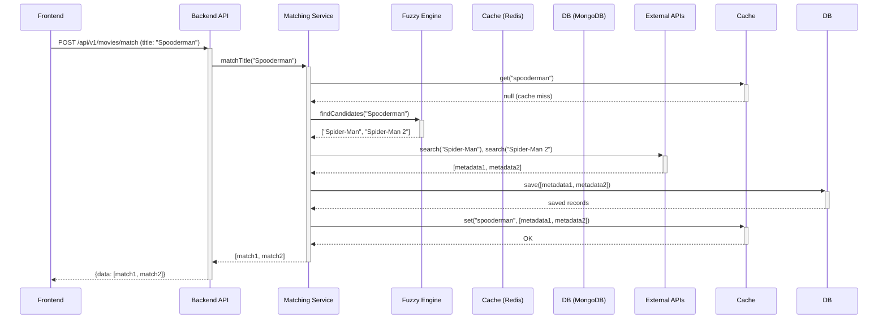

# Movie Title Matching System: Architectural Design

This document outlines the comprehensive architecture for a new movie title matching system designed to address the limitations of the current implementation.

## 1. System Architecture Diagram

The proposed architecture centralizes metadata management in the backend, introducing a dedicated matching service that integrates with external APIs and a caching layer.

```mermaid
graph TD
    A[Frontend] -->|1. Title Match Request| B(API Gateway);
    B -->|2. Forward Request| C{Movie Matching Service};
    C -->|3. Check Cache| D[Redis Cache];
    D --|>4a. Cache Hit| C;
    C --|>5a. Return Cached Metadata| B;
    B --|>6a. Return Metadata| A;
    D --|>4b. Cache Miss| C;
    C -->|5b. Normalize & Fuzzy Match| E(Fuzzy Matching Engine);
    E -->|6b. Get Candidates| C;
    C -->|7. Fetch from External APIs| F(External API Gateway);
    F -->|8. TMDB API| G[TMDB API];
    F -->|9. OMDB API| H[OMDB API];
    G --|>10a. Return Metadata| F;
    H --|>10b. Return Metadata| F;
    F -->|11. Aggregate & Score| C;
    C -->|12. Store in DB & Cache| I[MongoDB];
    C -->|13. Update Cache| D;
    I --|>| C;
    C --|>14. Return Metadata| B;
    B --|>15. Return Metadata| A;
```

## 2. Data Flow Diagram

The data flow illustrates the step-by-step process of matching a movie title, from the initial request to the final response.



## 3. Database Schema

The database will store both the canonical movie metadata and a cache of matching results to improve performance.

### `movies` Collection
- `_id` (ObjectId): Unique identifier
- `tmdb_id` (String): The Movie Database ID
- `imdb_id` (String): IMDb ID
- `title` (String): Primary title
- `normalized_title` (String): Lowercase, punctuation-removed title for matching
- `release_year` (Integer): Release year
- `genres` (Array[String]): List of genres
- `director` (String): Director's name
- `cast` (Array[String]): Main cast members
- `plot` (String): Movie synopsis
- `poster_url` (String): URL to the movie poster
- `ratings` (Object): e.g., `{ imdb: 8.8, rotten_tomatoes: 94 }`
- `created_at` (DateTime): Timestamp of creation
- `updated_at` (DateTime): Timestamp of last update

### `match_cache` Collection
- `_id` (ObjectId): Unique identifier
- `query` (String): The original search query
- `normalized_query` (String): Normalized version of the query
- `matches` (Array[Object]): List of matched movie candidates
  - `movie_id` (ObjectId): Reference to the `movies` collection
  - `confidence_score` (Float): The matching confidence score (0.0 to 1.0)
  - `match_type` (String): e.g., "FUZZY", "EXACT"
- `expires_at` (DateTime): TTL for cache expiration

## 4. API Endpoint Specifications

A new endpoint will be introduced for title matching, providing a standardized interface for the frontend.

### `POST /api/v1/movies/match`
- **Description**: Matches a movie title against the database and external APIs.
- **Request Body**:
  ```json
  {
    "title": "The Dark Nite",
    "year": 2008
  }
  ```
- **Success Response (200 OK)**:
  ```json
  {
    "data": [
      {
        "movie": {
          "id": "60c72b2f9b1d8c001f8e4d1e",
          "title": "The Dark Knight",
          "release_year": 2008,
          "poster_url": "https://example.com/poster.jpg"
        },
        "confidence_score": 0.92,
        "match_type": "FUZZY"
      }
    ]
  }
  ```
- **Error Response (404 Not Found)**:
  ```json
  {
    "error": "No matches found for 'The Dark Nite'"
  }
  ```

## 5. Fuzzy Matching Algorithm Strategy

The fuzzy matching algorithm will be a multi-step process to ensure high accuracy and performance.

1.  **Normalization**: The input title will be converted to lowercase, and all punctuation and special characters will be removed.
2.  **Tokenization**: The normalized title will be split into individual words (tokens).
3.  **Algorithm**: The system will use the **Levenshtein distance** algorithm to calculate the similarity between the input title and the titles in the database.
4.  **Scoring**: A confidence score will be generated based on the Levenshtein distance, with a lower distance resulting in a higher score.
5.  **Threshold**: A minimum confidence threshold (e.g., 0.7) will be used to filter out irrelevant matches.

## 6. Integration with External APIs

The system will integrate with TMDB and OMDB to ensure access to up-to-date and comprehensive movie metadata.

- **TMDB (The Movie Database)**: Primary source for high-quality posters, cast, and crew information.
- **OMDB (Open Movie Database)**: Secondary source and fallback for additional ratings and plot details.

An API key will be required for each service, and all requests will be funneled through a dedicated `ExternalAPIGateway` to manage rate limiting and error handling.

## 7. Caching and Performance Optimization

A multi-layered caching strategy will be implemented to minimize latency and reduce the number of external API calls.

- **In-Memory Cache (Redis)**: Frequently accessed movie metadata and match results will be stored in Redis for sub-millisecond access.
- **Database Cache (`match_cache`)**: Caches search results with a TTL to avoid re-computing fuzzy matches for common queries.
- **Cache Invalidation**: Caches will be invalidated automatically when a movie's metadata is updated.

## 8. Error Handling and Fallback Mechanisms

The system will be designed to be resilient and handle potential failures gracefully.

- **External API Failures**: If TMDB is unavailable, the system will automatically fall back to OMDB.
- **No Matches Found**: If no matches are found after checking all sources, the system will return a 404 response with a clear error message.
- **Rate Limiting**: The `ExternalAPIGateway` will implement rate limiting to prevent exceeding API quotas.
- **Logging**: All errors and significant events will be logged for monitoring and debugging purposes.